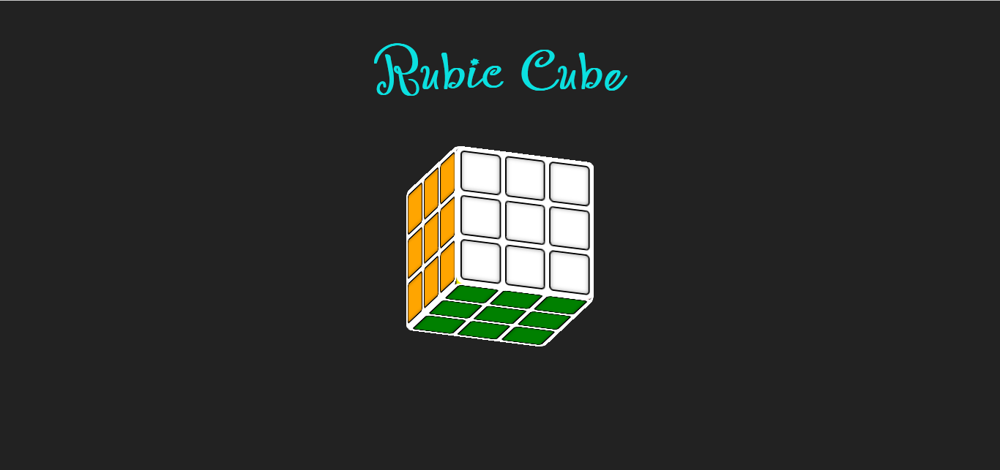

# HTML AND CSS PROJECT

## 🚀 **Description**
*THis project is based on making a 3d Rubic Cube using HTML and CSS only*

*Below we have the screenshot and demo video of the project*

## ✨ **Features**
- Cool 3d effect
- Smooth animation
- Responsive design

## 🛠️ **Technologies used**
- *HTML(Hypertext Markup Language)*
- *CSS(Cascading Style Sheet)*

## 📸 **Here is the screenshot of the project**

## 🎥 **Here is the demo video of the project**
<video controls>
    <source src="demo.mp4" type="video/mp4">
</video>

## 💻 **How to see it in vs studio**
- open index.html file in vs studio
- open style.css file in vs studio
- install line server extention
- there will be a option in html file click it and see the live view

## ✅**AUTHOR**
- *Shrestha Sutradhar*
